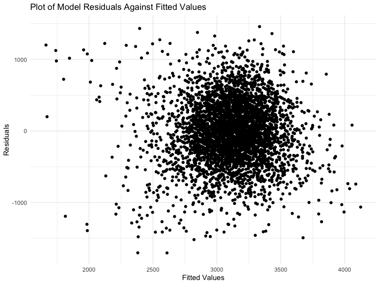
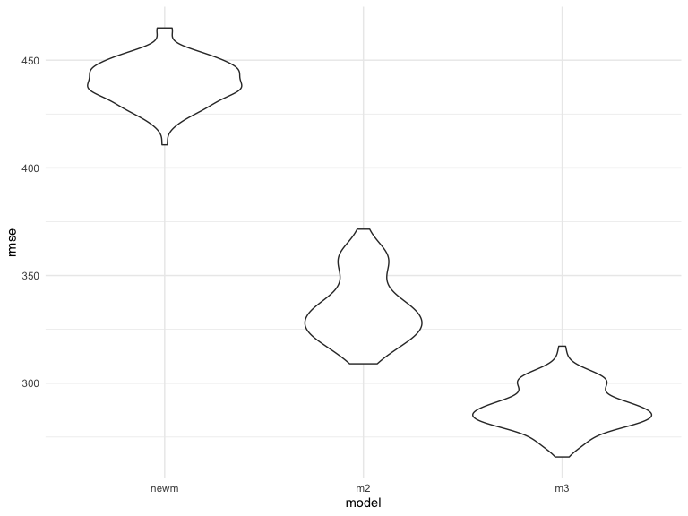
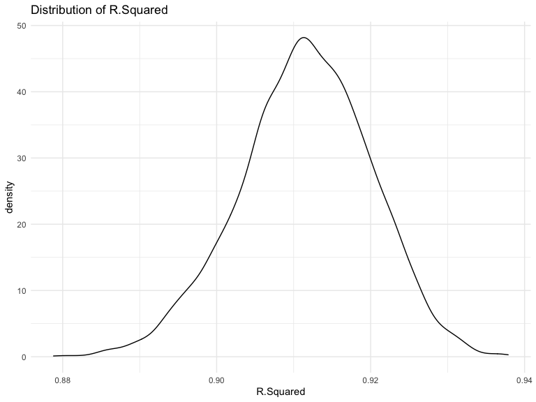
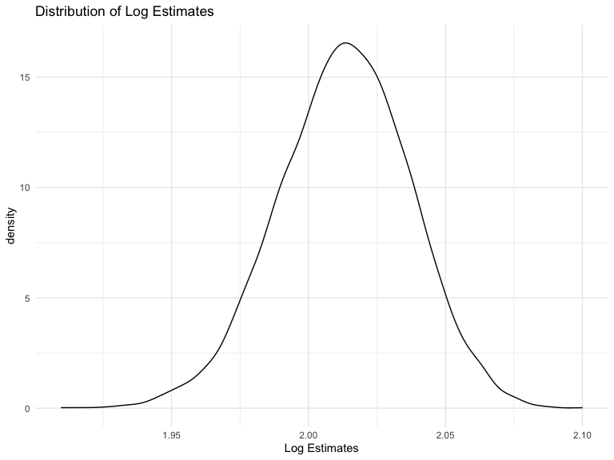

P8105\_HW\_hx2306
================
HuijunXiao
12/4/2021

### Problem 1

Load and clean the data for regression analysis.

``` r
btweight <-
  read_csv("./data/birthweight.csv")%>%
  janitor::clean_names() %>%
  mutate(babysex = factor(babysex),
         frace = factor(frace),
         mrace = factor(mrace),
         malform = factor(malform)) 
```

    ## Rows: 4342 Columns: 20

    ## ── Column specification ────────────────────────────────────────────────────────
    ## Delimiter: ","
    ## dbl (20): babysex, bhead, blength, bwt, delwt, fincome, frace, gaweeks, malf...

    ## 
    ## ℹ Use `spec()` to retrieve the full column specification for this data.
    ## ℹ Specify the column types or set `show_col_types = FALSE` to quiet this message.

``` r
sum(is.na(btweight))
```

    ## [1] 0

**There is no missing data.**

Propose a regression model for birthweight.  
1. Use stepwise regression to see what variables can be fitted in to the
final model.

``` r
step_fit <-
  lm(bwt ~ ., data = btweight)

step(step_fit, direction = "backward")
```

From the last step of stepwise regression, we find that `babysex`,
`bhead`, `blength`, `delwt`, `fincome`, `gaweeks`, `mheight`, `mrace`,
`parity`, `ppwt`, `smoken` are all related to `bwt`. Therefore, we
applied all these variables into the preliminary model.

``` r
model_step <- 
  lm(bwt ~ babysex + bhead + blength + delwt + fincome + gaweeks + mheight + mrace + parity + ppwt + smoken, data = btweight)
summary(model_step)
```

    ## 
    ## Call:
    ## lm(formula = bwt ~ babysex + bhead + blength + delwt + fincome + 
    ##     gaweeks + mheight + mrace + parity + ppwt + smoken, data = btweight)
    ## 
    ## Residuals:
    ##      Min       1Q   Median       3Q      Max 
    ## -1097.18  -185.52    -3.39   174.14  2353.44 
    ## 
    ## Coefficients:
    ##               Estimate Std. Error t value Pr(>|t|)    
    ## (Intercept) -6098.8219   137.5463 -44.340  < 2e-16 ***
    ## babysex2       28.5580     8.4549   3.378 0.000737 ***
    ## bhead         130.7770     3.4466  37.944  < 2e-16 ***
    ## blength        74.9471     2.0190  37.120  < 2e-16 ***
    ## delwt           4.1067     0.3921  10.475  < 2e-16 ***
    ## fincome         0.3180     0.1747   1.820 0.068844 .  
    ## gaweeks        11.5925     1.4621   7.929 2.79e-15 ***
    ## mheight         6.5940     1.7849   3.694 0.000223 ***
    ## mrace2       -138.7925     9.9071 -14.009  < 2e-16 ***
    ## mrace3        -74.8868    42.3146  -1.770 0.076837 .  
    ## mrace4       -100.6781    19.3247  -5.210 1.98e-07 ***
    ## parity         96.3047    40.3362   2.388 0.017004 *  
    ## ppwt           -2.6756     0.4274  -6.261 4.20e-10 ***
    ## smoken         -4.8434     0.5856  -8.271  < 2e-16 ***
    ## ---
    ## Signif. codes:  0 '***' 0.001 '**' 0.01 '*' 0.05 '.' 0.1 ' ' 1
    ## 
    ## Residual standard error: 272.3 on 4328 degrees of freedom
    ## Multiple R-squared:  0.7181, Adjusted R-squared:  0.7173 
    ## F-statistic: 848.1 on 13 and 4328 DF,  p-value: < 2.2e-16

From the summary of our model, we found that family monthly income
`fincome` and mother’s race `mrace3` is not significant, which means
their association with the outcome may be very weak and, therefore,
should not be included in to the final model. We also removed baby’s
head circumference at birth `bhead` and baby’s length at birth `blength`
from the model since it is possible that they overlap with the outcome.
However, removing them leaded to that number of live births prior to
this pregnancy `parity` became insignificant, which was removed finally
as well.

``` r
model_new <-
  lm(bwt ~ babysex + delwt + gaweeks + mheight + ppwt + smoken, data = btweight)
summary(model_new)
```

    ## 
    ## Call:
    ## lm(formula = bwt ~ babysex + delwt + gaweeks + mheight + ppwt + 
    ##     smoken, data = btweight)
    ## 
    ## Residuals:
    ##      Min       1Q   Median       3Q      Max 
    ## -1702.74  -266.91     7.91   283.63  1457.26 
    ## 
    ## Coefficients:
    ##               Estimate Std. Error t value Pr(>|t|)    
    ## (Intercept) -1170.5228   179.1144  -6.535 7.09e-11 ***
    ## babysex2      -94.0294    13.3610  -7.038 2.26e-12 ***
    ## delwt           9.1977     0.6212  14.807  < 2e-16 ***
    ## gaweeks        60.8016     2.1456  28.338  < 2e-16 ***
    ## mheight        21.1320     2.7918   7.569 4.56e-14 ***
    ## ppwt           -5.7976     0.6856  -8.456  < 2e-16 ***
    ## smoken         -7.5321     0.9033  -8.339  < 2e-16 ***
    ## ---
    ## Signif. codes:  0 '***' 0.001 '**' 0.01 '*' 0.05 '.' 0.1 ' ' 1
    ## 
    ## Residual standard error: 439.5 on 4335 degrees of freedom
    ## Multiple R-squared:  0.2647, Adjusted R-squared:  0.2637 
    ## F-statistic: 260.1 on 6 and 4335 DF,  p-value: < 2.2e-16

Show a plot of model residuals against fitted values.

``` r
model_plot <-
  btweight %>%
  add_residuals(model_new) %>%
   add_predictions(model_new) %>%
  ggplot(aes(x = pred, y = resid)) +
  geom_point() +
  labs(title = "Plot of Model Residuals Against Fitted Values", 
       x = "Fitted Values",
       y = "Residuals")
model_plot
```



Based on our plot of model residuals against fitted values, the direct
relationship between the predictor and residuals is not very clear.

Compare your model to two others:

1.  One using length at birth and gestational age as predictors (main
    effects only)

``` r
model2 <- lm(bwt ~ blength + gaweeks, data = btweight)
summary(model2)
```

    ## 
    ## Call:
    ## lm(formula = bwt ~ blength + gaweeks, data = btweight)
    ## 
    ## Residuals:
    ##     Min      1Q  Median      3Q     Max 
    ## -1709.6  -215.4   -11.4   208.2  4188.8 
    ## 
    ## Coefficients:
    ##              Estimate Std. Error t value Pr(>|t|)    
    ## (Intercept) -4347.667     97.958  -44.38   <2e-16 ***
    ## blength       128.556      1.990   64.60   <2e-16 ***
    ## gaweeks        27.047      1.718   15.74   <2e-16 ***
    ## ---
    ## Signif. codes:  0 '***' 0.001 '**' 0.01 '*' 0.05 '.' 0.1 ' ' 1
    ## 
    ## Residual standard error: 333.2 on 4339 degrees of freedom
    ## Multiple R-squared:  0.5769, Adjusted R-squared:  0.5767 
    ## F-statistic:  2958 on 2 and 4339 DF,  p-value: < 2.2e-16

2.  One using head circumference, length, sex, and all interactions
    (including the three-way interaction) between these

``` r
model3 <-
  lm(bwt ~ blength + bhead + babysex 
     + blength*bhead + blength* babysex + bhead*babysex + blength*bhead*babysex, 
     data = btweight)
summary(model3)
```

    ## 
    ## Call:
    ## lm(formula = bwt ~ blength + bhead + babysex + blength * bhead + 
    ##     blength * babysex + bhead * babysex + blength * bhead * babysex, 
    ##     data = btweight)
    ## 
    ## Residuals:
    ##      Min       1Q   Median       3Q      Max 
    ## -1132.99  -190.42   -10.33   178.63  2617.96 
    ## 
    ## Coefficients:
    ##                          Estimate Std. Error t value Pr(>|t|)    
    ## (Intercept)            -7176.8170  1264.8397  -5.674 1.49e-08 ***
    ## blength                  102.1269    26.2118   3.896 9.92e-05 ***
    ## bhead                    181.7956    38.0542   4.777 1.84e-06 ***
    ## babysex2                6374.8684  1677.7669   3.800 0.000147 ***
    ## blength:bhead             -0.5536     0.7802  -0.710 0.478012    
    ## blength:babysex2        -123.7729    35.1185  -3.524 0.000429 ***
    ## bhead:babysex2          -198.3932    51.0917  -3.883 0.000105 ***
    ## blength:bhead:babysex2     3.8781     1.0566   3.670 0.000245 ***
    ## ---
    ## Signif. codes:  0 '***' 0.001 '**' 0.01 '*' 0.05 '.' 0.1 ' ' 1
    ## 
    ## Residual standard error: 287.7 on 4334 degrees of freedom
    ## Multiple R-squared:  0.6849, Adjusted R-squared:  0.6844 
    ## F-statistic:  1346 on 7 and 4334 DF,  p-value: < 2.2e-16

Make this comparison in terms of the cross-validated prediction error.

``` r
cross_vali <- 
  crossv_mc(btweight, 100) %>% 
    mutate(train = map(train, as.tibble),
           test = map(test,as.tibble))  %>%
  mutate(model_new  = map(train, ~lm(bwt ~ babysex + delwt + gaweeks + mheight + ppwt + smoken, data = btweight)),
         model2  = map(train, ~lm(bwt ~ blength + gaweeks, data = btweight)),
         model3  = map(train, ~lm(bwt ~ blength + bhead + babysex + blength*bhead + blength* babysex + bhead*babysex + blength*bhead*babysex, data = btweight))) %>% 
  mutate(rmse_newm = map2_dbl(model_new, test, ~rmse(model = .x, data = .y)),
         rmse_m2 = map2_dbl(model2 , test, ~rmse(model = .x, data = .y)),
         rmse_m3 = map2_dbl(model3, test, ~rmse(model = .x, data = .y))) 

cross_vali %>% 
  select(starts_with("rmse")) %>% 
  pivot_longer(
    everything(),
    names_to = "model", 
    values_to = "rmse",
    names_prefix = "rmse_") %>% 
  mutate(model = fct_inorder(model)) %>% 
  ggplot(aes(x = model, y = rmse)) + 
  geom_violin()
```



Based on three violin plots, we found that model 3 `m3` has the lowest
rmse value, which means its prediction accuracy of linear regression
model is better than model 2 `m2` and our model `newm`. Therefore, we
should select model 3 as our final model.

### Problem 2

Download the dataset for 2017 Central Park weather data.

``` r
weather_df <- 
  rnoaa::meteo_pull_monitors(
    c("USW00094728"),
    var = c("PRCP", "TMIN", "TMAX"), 
    date_min = "2017-01-01",
    date_max = "2017-12-31") %>%
  mutate(
    name = recode(id, USW00094728 = "CentralPark_NY"),
    tmin = tmin / 10,
    tmax = tmax / 10) %>%
  select(name, id, everything())
```

Use 5000 bootstrap samples and, for each bootstrap sample, produce
estimates of these two quantities : *r̂*<sup>2</sup> and
*l**o**g*(*β̂*<sub>0</sub> \* *β̂*<sub>1</sub>).

``` r
btweight_boots <-
  weather_df %>% 
  modelr::bootstrap(n = 5000) %>% 
  mutate(models = map(strap, ~lm(tmax ~ tmin, data = .x) ),
         rsquare = map(models, broom::glance),
         results = map(models, broom::tidy)) %>% 
  select(-strap, -models) %>% 
  unnest(rsquare, results) %>% 
  select(term,estimate, r.squared) %>%
  mutate(term = str_replace(term, "\\(Intercept\\)","Intercept")) %>%
  pivot_wider(names_from = term,
              values_from = estimate) %>%
  mutate(log = log(Intercept*tmin)) %>%
  select(r.squared, log)  
```

1.  *r̂*<sup>2</sup>

``` r
btweight_boots %>%
  summarise(mean = mean(r.squared),
            lower = quantile(r.squared, 0.025),
            upper = quantile(r.squared, 0.975)) 
```

    ## # A tibble: 1 × 3
    ##    mean lower upper
    ##   <dbl> <dbl> <dbl>
    ## 1 0.911 0.894 0.927

``` r
plot_boots_r <- 
  btweight_boots%>%
  ggplot(aes(x = r.squared)) +
  geom_density()+
  labs(title = "Distribution of R.Squared", x = "R.Squared")

plot_boots_r
```



From distribution of r.squared plot, we can see it is close to normal
distribution, although there is a little bit left-skewed. R.squared mean
= 0.91, with 95% CI = (0.89, 0.93).

2.  *l**o**g*(*β̂*<sub>0</sub> \* *β̂*<sub>1</sub>)

``` r
btweight_boots %>%
  summarise(mean = mean(log),
            lower = quantile(log,0.025),
            upper = quantile(log, 0.975)) 
```

    ## # A tibble: 1 × 3
    ##    mean lower upper
    ##   <dbl> <dbl> <dbl>
    ## 1  2.01  1.96  2.06

``` r
plot_boots_log <- 
  btweight_boots%>%
  ggplot(aes(x = log)) +
  geom_density()+
  labs(title = "Distribution of Log Estimates", x = "Log Estimates")

plot_boots_log
```



From distribution pf log estimates plot, we can see it is close to
normal distribution, although there is a little bit left-skewed. Based
on the shape, it is possible that we have outliers. Log estimates mean =
2.01, with 95% CI = (1.97, 2.05).
